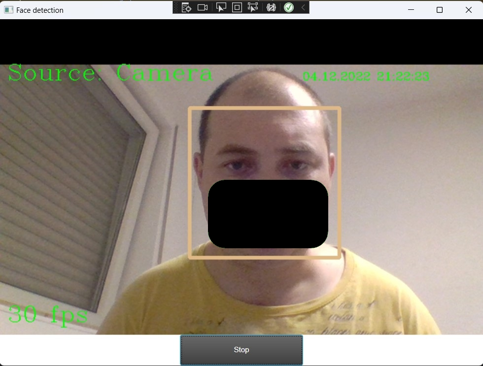

# Simple WPF MVVM Desktop application for facial detection in real time from web camera via Emgu
## This application use Emgu CV 4.1.1 framework from https://www.emgu.com/wiki/index.php/Main_Page

[](https://github.com/Ledrunning/FacialDetection/actions/workflows/dotnet-desktop.yml)

Emgu CV 4.1.1 version documentation available by current link: https://www.emgu.com/wiki/index.php/Version_History#Emgu.CV-4.1.1

Emgu CV 4.1.1 version download link https://sourceforge.net/projects/emgucv/files/emgucv/4.1.1/

To run app you should download Emgu CV from link above, install it, find and put these libraries into the bin folder (Debug or Release)
I used EMGU CV x64 version, so I put these libraries along this path *\bin\Debug\x64*
* concrt140.dll
* cvextern.dll
* msvcp140.dll
* opencv_videoio_ffmpeg411_64.dll.dll
* vcruntime140.dll

Or you be able to insert the libraries described above into your project tree and configure files to the output folder (set it as "copy if newer or copy always")

And don't forget about haarcascade_frontalface_default.xml just set copy to output directory in your project.

Logger is available in this project it writes all error and information data into a file.
You should find it in the bin folder and it called Logs

## For darcula or metro themes I used WPFToolkit and WPFToolkit.DataVisualization (JenniLe, Shimmy)
To change themes manually you should comment old and uncomment required theme in App.xaml f.e Metro Dark Theme:

<details> 
  <summary>Theme settings in Application.Resources</summary>
  
  ```xml
     <Application.Resources>
        <ResourceDictionary>
            <ResourceDictionary.MergedDictionaries>
                <!-- IG Theme -->
                <ResourceDictionary Source="Themes/IG/IG.MSControls.Core.Implicit.xaml" />
                <ResourceDictionary Source="Themes/IG/IG.MSControls.Toolkit.Implicit.xaml" />

                <!-- Metro Theme -->
                <!--<ResourceDictionary Source="Themes/Metro/Metro.MSControls.Core.Implicit.xaml" />
                <ResourceDictionary Source="Themes/Metro/Metro.MSControls.Toolkit.Implicit.xaml" /> -->

                <!-- MetroDark Theme -->
                <!--<ResourceDictionary Source="Themes/MetroDark/MetroDark.MSControls.Core.Implicit.xaml" />
                <ResourceDictionary Source="Themes/MetroDark/MetroDark.MSControls.Toolkit.Implicit.xaml" /> -->
            </ResourceDictionary.MergedDictionaries>

            <!-- <SolidColorBrush x:Key="BackgroundKey" Color="#FFFFFF" /> Color="#FF181818" -->

            <!-- Dark Theme -->
            <SolidColorBrush x:Key="BackgroundKey" Color="#FFFFFF" />

            <Style x:Key="HeaderTextBlockStyle" TargetType="TextBlock">
                <Setter Property="FontSize" Value="22" />
                <Setter Property="FontFamily" Value="Segoe UI" />
                <Setter Property="Foreground" Value="#FF00AADE" />
            </Style>

            <Style x:Key="SubHeaderTextBlockStyle" TargetType="TextBlock">
                <Setter Property="FontSize" Value="18" />
                <Setter Property="FontFamily" Value="Segoe UI" />
                <Setter Property="Foreground" Value="#FF00AADE" />
            </Style>
        </ResourceDictionary>
        </Application.Resources>
  ```
  
</details>

## If you have any problems, you can always create an Issue!

## UI Layuot: 


